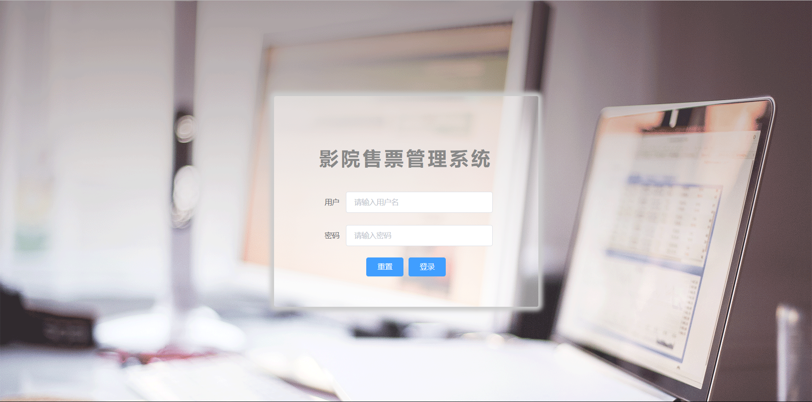
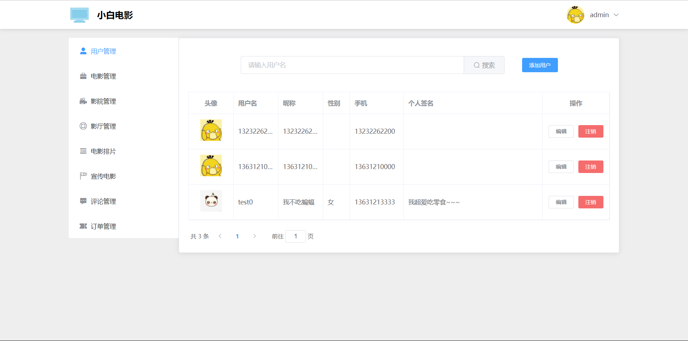
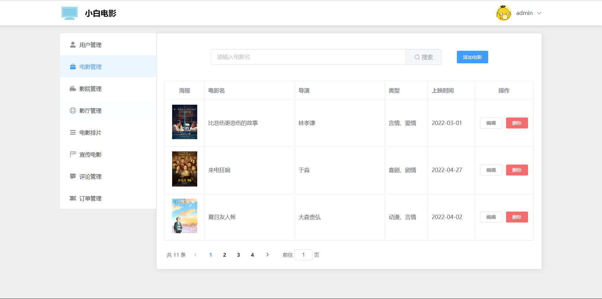
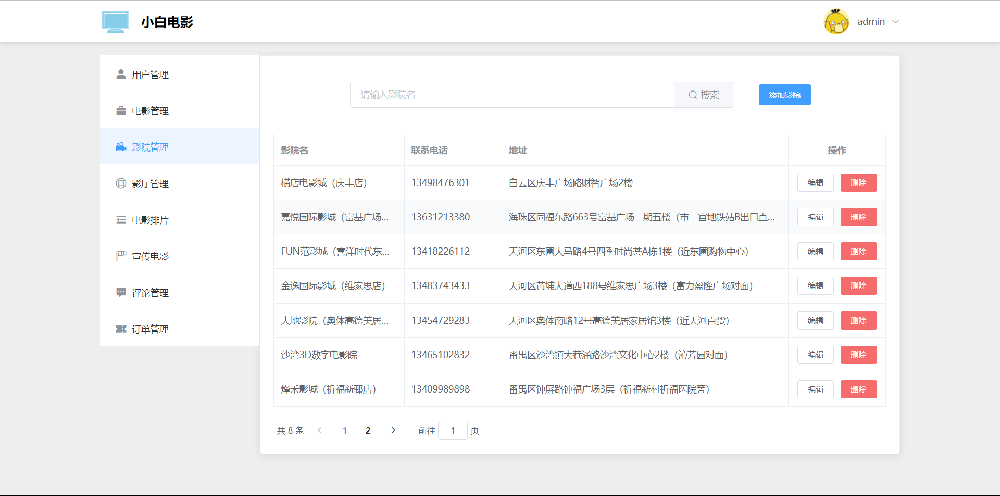
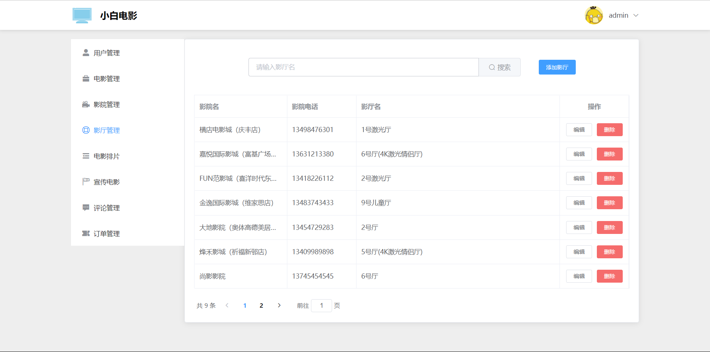
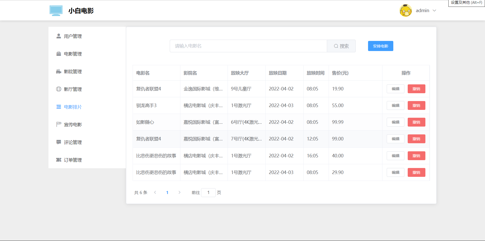
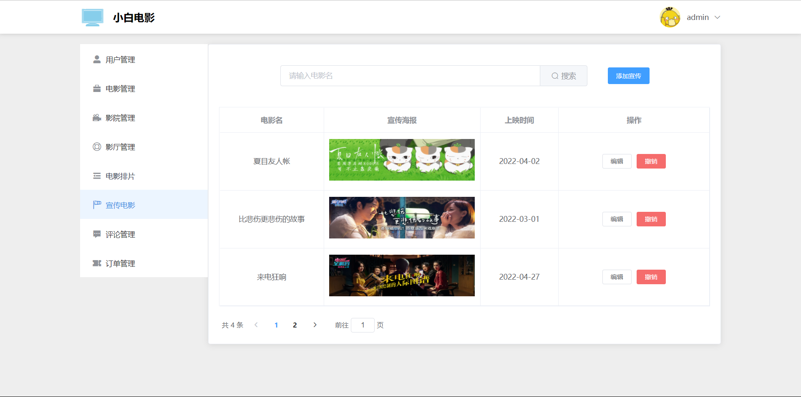
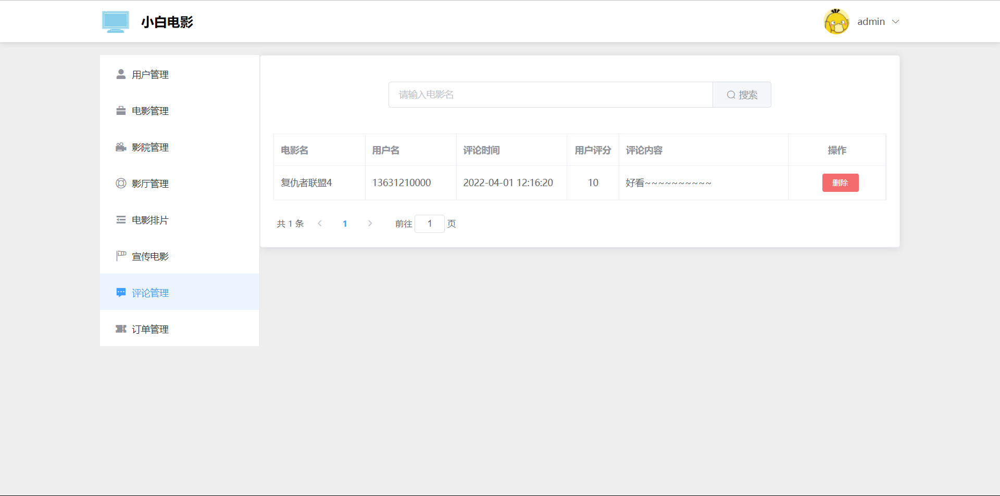
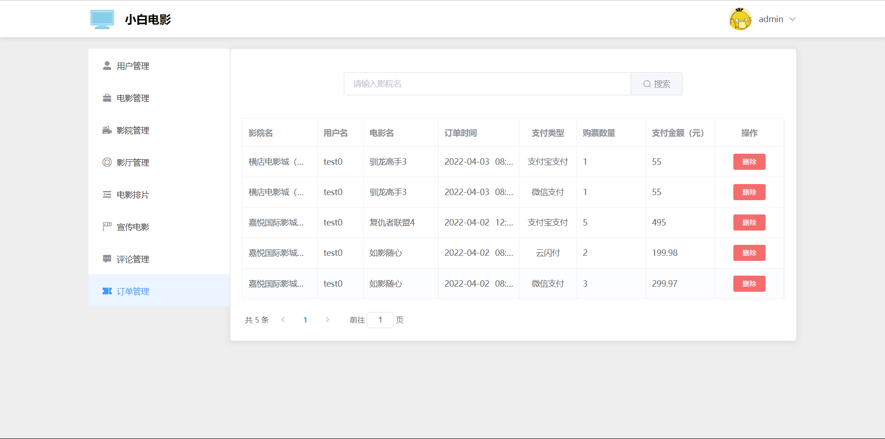

# 后台管理部分

## 简介

该部分用的vue2.0结合element ui开发而成

## 页面组成

### 1.登录页

### 2.用户管理页

### 3.电影管理页

### 4.影院管理页

### 5.影厅管理页

### 6.电影排片页

### 7.宣传电影页

### 8.评论管理页

### 9.订单管理页

## 实现功能

1.前台用户的增删改查

2.前台电影的增删改查

3.前台影院的增删改查

4.前台影厅的增删改查

5.前台电影排片的增删改查

6.前台首页轮播图的增删改查

7.前台用户的评论审核、查询、删除

8.前台用户订单查询、删除
