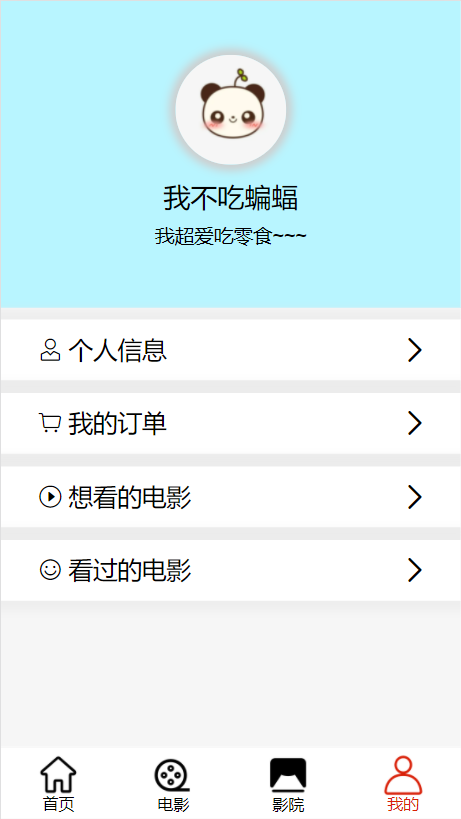
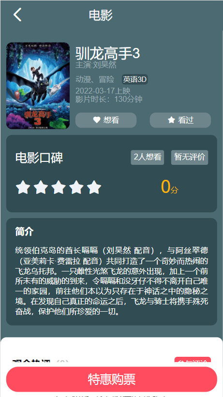
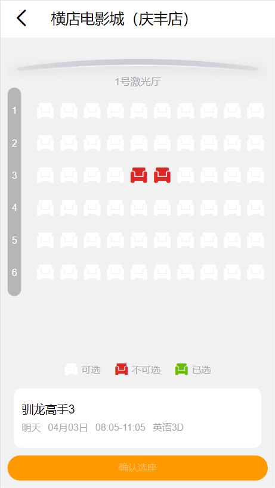
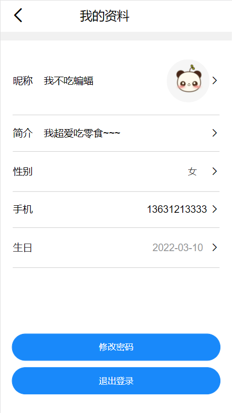
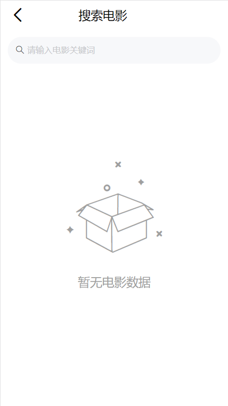

# 前台展示页面部分

## 简介

该部分用的vue2.0结合vant开发而成

# 页面组成

## 1.注册登录页

## 2.首页

## 3.电影页

## 4.影院页

## 5.个人中心页

## 6.电影详情页

## 7.影院选择页

## 8.影院详情页

## 9.座位选择页

## 10.确认订单页

## 11.订单支付页

## 12.个人信息页

## 13.我的订单页

## 14.想看的电影页

## 15.看过的电影页

## 16.电影搜索页

## 17.影院搜索页

# 实现功能

1.用户的注册与登录（注册登录页）

2.用户信息的查询、修改，用户密码的修改（个人信息页）

3.用户标记电影想看和取消标记，用户标记看过并评论（电影详情页、影院选择页）

4.用户点赞评论（电影详情页）

5.用户选座（座位选择页）

6.用户支付订单（订单支付页）

7.用户订单的查询、删除（我的订单页）

8.用户想看的电影的查询与删除想看（想看的电影页）

9.用户看过的电影的查询与删除看过（看过的电影页）

10.电影的搜索（电影搜索页）

11.影院的搜索（影院搜索页）

# 页面实现逻辑记录

## 1.登录判断函数

在用户使用到需要登录权限的功能，都会提示请先登录并跳转注册登录页，因为多个页面都要用到该判断，所以该函数可以采用混入的方法在main.js里面混入

### 注意：

在登录判断中，分别有4种情况，遇到这4种情况，都需要跳转登录注册页面

情况1：在localStorage中获取不到token

解决方法：直接用!WebToken判断，直接跳转

情况2：在localStorage中获取不到userId（用户id）

解决方法：直接用!userId判断，直接跳转

情况3：token是伪造的

解决方法：直接进行网络请求，如果请求返回401，证明token无效或过期，这时可以在http拦截器中判断，如果请求状态码为401就清除token和userId，这样下次请求就可以以情况1、2来跳转

情况4：userId是伪造的

这里有两次情况，因为我用的是mongodb，他的表数据id固定长度24，所以情况1：非24位为伪造，情况2：24位的伪造

解决方法：情况1用userId.length !== 24来判断，情况2用网络请求来判断，因为每次成功请求，我们可以返回一个status=’Ok‘，而如果我们没有收到Ok，那就是请求失败，该id在数据库中查不到用户，这时就跳转
